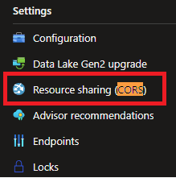

# Set up streaming directly from Azure blob storage

1. Enable CORS:

    From Azure portal, navigate to your migrated storage account page.  You can enable CORS by scrolling down on the left bar to find the 'Resource sharing (CORS)' setting and click on it to enable CORS.

    
    
    An example test settings is shown in the table below, but you can adjust it according to your own security preference.  An useful reference to the settings is this page [azure storage services cors setting documentation](https://learn.microsoft.com/en-us/rest/api/storageservices/cross-origin-resource-sharing--cors--support-for-the-azure-storage-services)

    | Fields | Value |
    | ---    | ---   |
    | Allowed origins | * |
    | Allowed methods | GET,PUT,OPTIONS |
    | Allowed headers | * |
    | Exposed headers | * |
    | Max age         | 5 |

2. Share blob container:

    You will need to enable public access to your migrated storage account, and also share each containers that you want to stream from.  You can find the instructions in the following Azure documentation [configure anonymous public read access from containers and blobs](https://learn.microsoft.com/en-us/azure/storage/blobs/anonymous-read-access-configure?tabs=portal)

3. Find the streaming url:

    You can construct the list of streaming urls for your migrated assets by running 
    
        AMSMigrate.exe analyze -s <subscription> -g <resource group of media service> -n <media service account name>

    and look at the output html file.

    For each streamable asset, you will take the 'OutputPath' and 'ManifestName' columns to construct the DASH and HLS url.  The rule is that you concatenate the OutputPath with ManifestName and then append .mpd or .m3u8 to get DASH or HLS url.

    An example, if we have the following,

    | OutputPath | ManifestName |
    | ---  | ---   |
    | https://test.blob.core.windows.net/ams-migration-output/asset-1234/ | fun_video |

    then we will construct the following streaming urls,

    | Type | Link |
    | ---  | ---   |
    | DASH:| https://test.blob.core.windows.net/ams-migration-output/asset-1234/fun_video.mpd |
    | HLS: | https://test.blob.core.windows.net/ams-migration-output/asset-1234/fun_video.m3u8 |